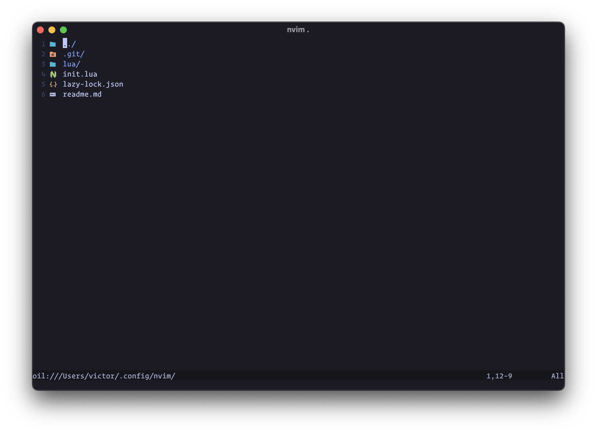

<h1>nvimrc 🌱</h1>

This is my personal minimal neovim configuration. It is a work in progress and will be updated as I learn more about vim and neovim.



## Features

- [x] LSP
- [x] Treesitter
- [x] Telescope
- [x] Conform (Autoformat)
- [x] Vim Fugitive (Git)
- [x] Copilot
- [x] Autopairs
- [x] Oil
- [x] Tokyonight 

## Requirements

### Icons for Kitty

1. Install Nerd Font Symbols
2. Download Nerd Font Symbols Only `brew install font-symbols-only-nerd-font` [release](https://github.com/ryanoasis/nerd-fonts/releases).
3. Add symbols to `.config/kitty`

```
# - Use additional nerd symbols
# See https://github.com/be5invis/Iosevka/issues/248
# See https://github.com/ryanoasis/nerd-fonts/wiki/Glyph-Sets-and-Code-Points
# Seti-UI + Custom
symbol_map U+E5FA-U+E62B Symbols Nerd Font
# Devicons
symbol_map U+E700-U+E7C5 Symbols Nerd Font
# Font Awesome
symbol_map U+F000-U+F2E0 Symbols Nerd Font
# Font Awesome Extension
symbol_map U+E200-U+E2A9 Symbols Nerd Font
# Material Design Icons
symbol_map U+F500-U+FD46 Symbols Nerd Font
# Weather
symbol_map U+E300-U+E3EB Symbols Nerd Font
# Octicons
symbol_map U+F400-U+F4A8,U+2665,U+26A1,U+F27C Symbols Nerd Font
# Powerline Extra Symbols
symbol_map U+E0A3,U+E0B4-U+E0C8,U+E0CC-U+E0D2,U+E0D4 Symbols Nerd Font
# IEC Power Symbols
symbol_map U+23FB-U+23FE,U+2b58 Symbols Nerd Font
# Font Logos
symbol_map U+F300-U+F313 Symbols Nerd Font
# Pomicons
symbol_map U+E000-U+E00D Symbols Nerd Font


# https://github.com/ryanoasis/nerd-fonts/wiki/Glyph-Sets-and-Code-Points
symbol_map U+E5FA-U+E62B Symbols Nerd Font
# Devicons
symbol_map U+e700-U+e7c5 Symbols Nerd Font
# Font Awesome
symbol_map U+f000-U+f2e0 Symbols Nerd Font
# Font Awesome Extension
symbol_map U+e200-U+e2a9 Symbols Nerd Font
# Material Design Icons
symbol_map U+f0001-U+f1af0 Symbols Nerd Font
# Weather
symbol_map U+e300-U+e3e3 Symbols Nerd Font
# Octicons
symbol_map U+f400-U+f532 Symbols Nerd Font
symbol_map U+2665 Symbols Nerd Font
symbol_map U+26A1 Symbols Nerd Font
# [Powerline Symbols]
symbol_map U+e0a0-U+e0a2 Symbols Nerd Font
symbol_map U+e0b0-U+e0b3 Symbols Nerd Font
# Powerline Extra Symbols
symbol_map U+e0b4-U+e0c8 Symbols Nerd Font
symbol_map U+e0cc-U+e0d4 Symbols Nerd Font
symbol_map U+e0a3 Symbols Nerd Font
symbol_map U+e0ca Symbols Nerd Font
# IEC Power Symbols
symbol_map U+23fb-U+23fe Symbols Nerd Font
symbol_map U+2b58 Symbols Nerd Font
# Font Logos (Formerly Font Linux)
symbol_map U+f300-U+f32f Symbols Nerd Font
# Pomicons
symbol_map U+e000-U+e00a Symbols Nerd Font
# Codicons
symbol_map U+ea60-U+ebeb Symbols Nerd Font
# Heavy Angle Brackets
symbol_map U+e276c-U+2771 Symbols Nerd Font
# Box Drawing
symbol_map U+2500-U+259f Symbols Nerd Font
```

